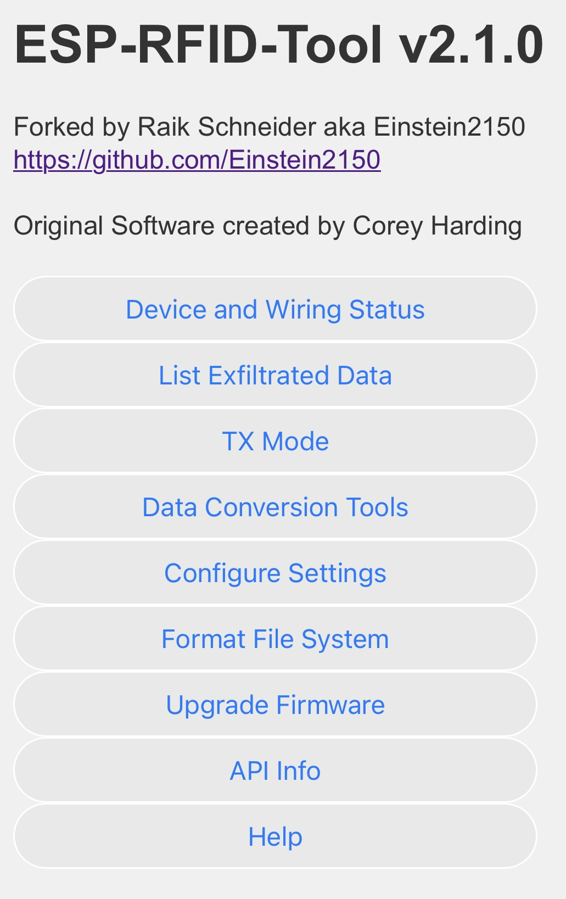

# ESP-RFID-Tool-v2 
Forked by Raik Schneider aka Einstein2150

Original Software by Corey Harding  
  
  

  
  * ESP-RFID-Tool-v2: https://github.com/Einstein2150/ESP-RFID-Tool-v2/releases  
  * Releases are compiled with esp8266 board manager package 2.4.0  
 
## improved features compared to the original version 

### UI 2.0
  * modern user interface
  * optimised for mobile devices (i.e. bigger buttons than small textlinks)

### replay 2.0
  * MOSFET's ground the DATA-lines while **replaying data more stable than the original board** can do
  * new **direct-replay-feature** in the log. Pick your capture and replay it with one click! (field-tested with Wiegand-34bit and keypad)

### Status page  
  * new **status-page** with useful informations:
   * 	Wiegand-wiring-check
   *   Device Uptime
   *   Memory informations
  
### Hex-Magic in captured data
  * the logfile now lists the **cleaned HEX of the card** (free of control bits-data)
  * for **RFID-cards the UID is calculated** and printed in the log. This makes the creation of clonecards more easy

## schematic and wiring for board-v2 (based on nodemcu)  
* board-v2 could be easily build by yourself:

* it has an additional voltage regulator for higher voltage
* board-v2 uses 2 MOSFET (i.e. 2N7000) for replay-attacks which makes the ability of stronger comunication because the Wiegand datalines get strong grounded
*  you can use the ESP-RFID-Tool-v2 firmware on the original board from Corey Harding but it wouldn't have the improvements because they relie on additional hardware.

This is the preferred board design with uses a 7805 5V voltage regulator for feeding the esp by the vin-pin which is regulated by the nodemcu-own voltage regulator to 3.3V which should be safe until 25V:

Alternative:

If you know your voltage ratings you can use a 3.3 voltage regulator like the 1117 too but it should not be more than 15V.

You are always free to power the nodemcu natively by the VIN-pin but be sure not to exceed 9V for the nodemcu:
 
 
  
## Intended use cases  
* Security researchers performing red team assessments.  
  * Capturing card values to later be cloned.  
  * Replaying raw binary captures.*(see note below)  
  * Fuzzing access control systems.*(see note below)  
  * Brute forcing PIN codes.*(see note below) 
  * Denial of Service mode.*(see note below) 
* To create a standalone device for capturing credentials or testing badges and or card readers without the need for a Wiegand Controller.  
  * Add a battery and a card reader to make the unit portable.  
  * Add a benchtop power supply to use for testing hardware.  
* Installers troubleshooting issues with a card reader, the data lines, or even testing for a faulty card.  
* Useful for merchants or surplus resellers who are testing if access control equipment is functional.  
* Hobbyist experimenting with various systems that utilize a Wiegand Interface.  
* Simulating an access control system using multiple units of ESP-RFID-Tool.  
* RFID-Tool is not intended to be used in any unlawful manner.  
  
## What is it?  
A universal data logger that captures the raw binary data from a standard 5V Wiegand Interface. The device is capable of logging the credentials for access control systems or nearly any device that utilizes a Wiegand Interface such as RFID card readers, pin pads, magnetic stripe systems, barcode, and even some biometric readers. Wiegand Interfaces also do not have to be limited to just access control systems. The main target group for this device is 26-37bit HID cards.  For known card types both the binary and hexadecimal data is displayed directly in the log file for easy badge identification and also in case a clone of a card may be needed. For unknown card types only the raw binary data is shown.  
  
## How do you install it?  
The device may be installed directly into an existing system drawing its power from the preexisting wiring or it can also be used to turn a reader into a standalone portable unit for data logging when a battery is added. Wiring is simple and consists of 4 wires, (+), (-), D0(Green), and D1(White). The device is capable of operating on voltages ranging from around 4.5V up to a maximum of 12v. Commonly found voltages are 12V and 5V. **(See Installation Notes Below)  
  
## How do you access the logs?  
Access to the log files and various settings is provided via a web based interface. The device has WiFi capabilities and can be set up to spawn its own access point or set to connect to an existing network. In the event you get locked out of the web interface you can bridge the J3 jumper on power up or while resetting the device to regain access without losing your log files.  
  
## I want to know a little more...
The hardware is based on an ESP12 WiFi chip with a full TCP/IP stack and Microcontroller Unit. The software is open source licensed under the MIT License and will be released the day the product is launched. The software will reside in this GitHub repo so it may be reviewed by the community. We will accept various pull requests from the community after being reviewed if it improves the value of the device for others. The software was written in the Arduino IDE so both hobbyist and professionals will have no issue modifying the code if they so choose.  A Wiegand Interface operates using 3 wires, a ground, Data0, and Data1. A zero is sent when D0 goes low and a one is sent when D1 goes low, the other line remains high during this time. The timing is 40uS from low to high on a line with 2mS between bits. The software logs this binary output to a file and if the device thinks it is a known card format the preamble is guessed(not sent by card reader but it is the same for all cards of a specific format, our primary target is 26-37bit HID cards) and both the raw binary and hexadecimal data is logged. For unkown card formats only the raw binary output is logged with no guess at the preamble and without showing the data in hexadecimal format to prevent confusion. If you know what kind of card was captured, simply look up the preamble and add it to the beginning of the binary then typically convert it to hexadecimal format to make a clone of a card. It is possible the card is actually an unknown format and the preamble was guessed incorrectly with the device thinking it was a known card format(the guess is based on the bit count output by the reader), if this is the case in the log file there is a literal space in the binary between the preamble and the card data, simply ignore the preamble. When replaying a captured credential*(see note below) you do not include the preamble as that is not output by the card reader but instead you only replay*(see note below) the actual card data as output from the reader. You only need to worry about the preamble if making a clone of a card. The primary function of this device is for logging the raw binary data as output from a Wiegand Interface. You can read from 1 bit all the way up to 4,096 bits. The default buffer setting only allows 52 bits and must be manually increased from the settings page accessible from the web interface.  
  
## TX Mode  
With the board-v2 you can transmit Wiegand-data with full power because the MOSFETs drop the data-lines hard to ground. But be aware. There is a risk when the device is in TX mode and the output goes low. If the device is also receiving data during this time there will be a short. For this reason be sure that absoulutely no cards are being scanned while the device is in TX mode. The device does not go into TX mode until you press on a form submit button and as soon as the data is done being transmitted it goes back into listening mode. 
  
## **Installation Notes  
[Click here for wiring diagrams](Installation-Schematics/README.md)  
[Click here to see connector options](/Connector-Adapter-Options/README.md)  
* Make sure the reader outputs data in the Wiegand format  
* Connect D0 on device to D0 on reader  
* Connect D1 on device to D1 on reader  
* Connect + on device to + on reader  
* Connect - on device to - on reader  

* The ESP-RFID-Tool-v2 based on nodemcu with an external 5v voltage regulator accepts 7-25v
* If you use the external 3.3v voltage regulator you should not exceed 15v

* At a minimum D0, D1, and GND(-) must be connected to the reader for proper function, no matter the power source.
* You can check the wiring on the status-page of the device   

  
## Making Sense of the Binary Data  
[Keypads](Keypad/README.md)  
[Magstripe/ABA Format](Magstripe/README.md)  
  
## Flashing Firmware  
OPTION 1: OTA via the Web Interface:
  
* Download one of the latest releases from  
  * hhttps://github.com/Einstein2150/ESP-RFID-Tool-v2/releases  
* Login to the device's admin panel and upgrade the firmware.  

OPTION 2: ESPWebTool:

* Download the firmware-bin from the release-page
* use a webtool like https://esp.huhn.me/
  
OPTION 3: Arduino IDE: 
 
* Use the ESP Flasher R4 by April Brother:  
  * https://blog.aprbrother.com/product/esp-flasher-r4  
* Clone/download the source.  
* Add these libraries:  
  * ArduinoJson library 5.13.1 by Benoit Blanchon  
    * https://github.com/bblanchon/ArduinoJson  
  * ESP8266FtpServer.h  
    * https://github.com/exploitagency/esp8266FTPServer/tree/feature/bbx10_speedup  
* Choose the board NodeMCU 1.0.  
* Upload.  
  
## Software Help    
  
### Accessing ESP-RFID-Tool Web Interface  
  
SSID: "ESP-RFID-Tool"  
URL:  http://192.168.1.1  
  
### Configure ESP-RFID-Tool  
  
#### Default credentials to access the configuration page:  
* Username: "admin"  
* Password: "rfidtool"  
  
#### Default credentials for ftp server:  
* Username: "ftp-admin"  
* Password: "rfidtool"  
  
#### WiFi Configuration:  
  
Network Type:  
* Access Point Mode: Create a standalone access point(No Internet Connectivity-Requires Close Proximity)  
* Join Existing Network: Join an existing network(Possible Internet Connectivity-Could use Device Remotely)  
  
Hidden: Choose whether or not to use a hidden SSID when creating an access point  
  
SSID: SSID of the access point to create or of the network you are choosing to join  
Password: Password of the access point which you wish to create or of the network you are choosing to join  
Channel: Channel of the access point you are creating  
  
IP: IP to set for device  
Gateway: Gateway to use, make it the same as ESP-RFID-Tool's IP if an access point or the same as the router if joining a network  
Subnet: Typically set to 255.255.255.0  
  
#### Web Interface Administration Settings:  
  
Username: Username to configure/upgrade ESP-RFID-Tool  
Password: Password to configure/upgrade ESP-RFID-Tool  
  
FTP Server Settings:  
  
Note: Supports Passive(PASV) Mode Only!  
* Enabled: Turn FTP Server ON  
* Disabled: Turn FTP Server OFF  
Username: Username to login to ftp server  
Password: Password to login to ftp server  
  
Power LED:  
  
* Enabled: Turn ON Power LED  
* Disabled: Turn OFF Power LED  
  
RFID Capture Log:  
  
Useful to change this value to differentiate between facilities during various security assessments.  
File Name: File name to save captured RFID tags to for the current security assessment.  
  
#### List Exfiltrated Data  
  
Displays all log files containing RFID tag captures.  
  
#### Format File System  
  
This will erase the contents of the SPIFFS file system including ALL RFID tag captures.  
Formatting may take up to 90 seconds.  
All current settings will be retained unless you reboot your device during this process.  
  
#### Upgrade ESP-RFID-Tool Firmware  
  
Authenticate using your username and password set in the configuration page.  
  
Default credentials to access the firmware upgrade page:  
* Username: "admin"  
* Password: "rfidtool"  
  
Select "Browse" choose the new firmware to be uploaded and then click "Upgrade".  
  
You will need to manually reset the device upon the browser alerting you that the upgrade was successful.  
  
#### Reset  
      
* GPIO 4 / D2: Ground this during a power cycle to restore default configuration without losing your log files.  
  
#### Restore Default Settings  
    
* Option 1: Go to settings under web interface and choose restore default configuration.  
* Option 2: Ground GPIO 4 / D2 before booting the device. (Either before powering on or bridge it and reset the device)   
* Option 3: Connect via serial(9600 baud) and send the command "ResetDefaultConfig:" without quotes.  
  
  
## Licensing Information  
    
This software was originally created by Corey Harding  
https://github.com/rfidtool/ESP-RFID-Tool  
ESP-RFID-Tool software is licensed under the MIT License  
  
#### Libraries/borrowed code being used  
  
##### Arduino and ESP8266 core libraries  
* Typically: GNU LESSER GENERAL PUBLIC LICENSE Version 2.1  
  * Assorted Authors  
  
##### ArduinoJson.h  
* The MIT License (MIT)  
  * Copyright (c) 2014-2017 Benoit BLANCHON  
  
##### ESP8266FtpServer.h  
* GNU LESSER GENERAL PUBLIC LICENSE Version 2.1  
  * Originally by nailbuster, later modified by bbx10 and apullin  
  
##### WiegandNG.h  
* GNU LESSER GENERAL PUBLIC LICENSE Version 2.1  
  * JP Liew  
  
##### Wiegand Preamble Calculator Code  
* No License Specified  
  * Fran Brown of Bishop Fox  
  
##### strrev.h  
* Custom License(see file)  
  * Copyright (c) 2007 Dmitry Xmelkov  
  
##### aba-decode.py  
* No License Specified  
  * Andrew MacPherson(andrewmohawk)  

##### hexmagic.h  
* Custom License(see file)  
  * Copyright (c) 2024 Raik Schneider aka Einstein2150 
